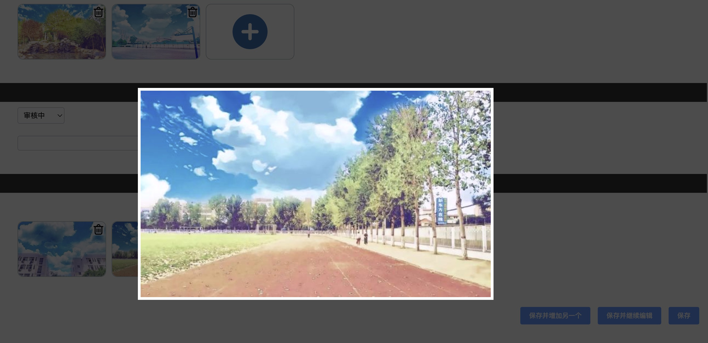

django_imguploder
-----
👍 后台上传图片

⚡️ 单图片、多图片批量上传

✨ 图片大图预览、删除

🐰 图片旋转预览

🔥 支持键盘快捷操作

    1.支持左右键切换预览图片
    
    2.支持ESC退出预览模式

🌈 效果图片



安装
-----
`pip install django-imgwidget`

`主页: https://pypi.org/project/django-imgwidget`

步骤
-----
- 在settings.py中加入 `django_imguploder`

- 配置上传图片路由
```python
path("upload", ImageUploadView.as_view(), name='upload_image')
```

- 编写视图函数 example
```python 
class ImageUploadView(views.View):
    def post(self, request):
        files = request.FILES or {}
        files = list(files.values())
        image_list = []
        for file in files:
            img_url = FileUploadManager.upload(file)
            if img_url:
                image_list.append(img_url)
        return JsonResponse({"code": code, 'msg': msg, 'data': {"image_list": image_list}})
```

- 使用组件 example

models.py:
```python 
    imgs = models.TextField(default="", null=False, verbose_name='图片')
    certificate_imgs = models.TextField(default="", verbose_name='认证图片') 
```

admin:
```python
class UploadImgsForm(ModelForm):
    imgs = forms.CharField(label="图片", widget=MultiImagesInputWidget, required=False)
    certificate_imgs = forms.CharField(label="认证图片", widget=MultiImagesInputWidget, required=False)


class MyAdmin(admin.ModelAdmin):
    ...
    form = UploadImgsForm
```

- 如果想保存为json格式，例如：['111.jpg', '222.jpg']
```
def save_model(self, request, obj, form, change):
    for img in ['imgs', 'certificate_imgs']:
        setattr(obj, img, json.dumps(get_imgs_value(form.cleaned_data.get(img))))
    return super(MyAdmin, self).save_model(request, obj, form, change)
```