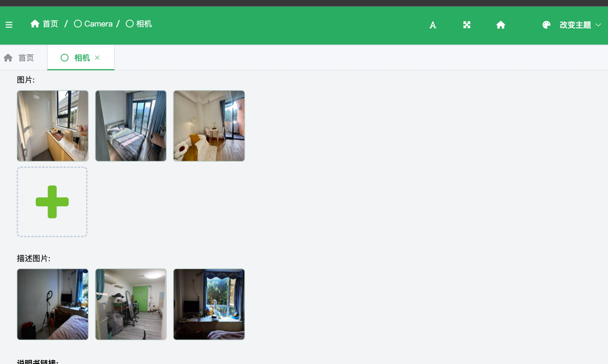
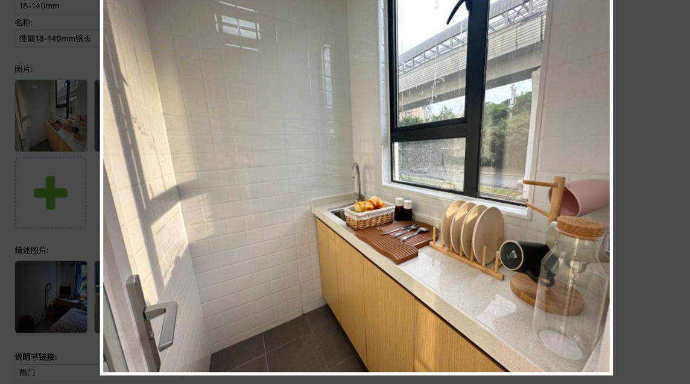

# django-imgwidget

[](https://opensource.org/licenses/MIT)
[](https://pypi.org/project/django-imgwidget)

**django-imgwidget** is a Django package that provides easy and efficient image uploading in the admin site. It supports single-image uploads as well as batch uploads for multiple images. The package comes with features like large image preview, image deletion, and image rotation preview.

## Features
- Save as json or string to a field
- Single-image and batch upload support.
- Large image preview with the ability to delete images.
- Image rotation preview for a better viewing experience.
- Keyboard shortcuts for enhanced user experience.

## Installation

Install the package using pip:

```bash
pip install django-imgwidget


-----
👍 后台上传图片

⚡️ 单图片、多图片批量上传

✨ 图片大图预览、删除

🐰 图片旋转预览

🔥 支持键盘快捷操作

    1.支持左右键切换预览图片
    
    2.支持ESC退出预览模式
```

🌈 效果图片



!

Installation
-----
`pip install django-imgwidget`

`Homepage: https://pypi.org/project/django-imgwidget`

Steps
-----
- Add `django_imguploder` to your settings.py

- Configure the image upload route, route name is `upload_image`

```python
path("upload", ImageUploadView.as_view(), name='upload_image')
```

- Write a view function.
Need to return JsonResponse `image_list error_msg`, if there are errors, return error_msg error prompt. example:
```python 
class ImageUploadView(views.View):
    def post(self, request):
        files = request.FILES or {}
        image_list = [upload_img(file) for file in list(files.values())]
        return JsonResponse({
            "error_msg": "",
            "image_list": image_list,
        })
```

- Use the MultiImageField in admin.py

```python
# models.py
class MyModel(models.Model):
    imgs = models.TextField(default=[], null=False, verbose_name='图片')
    description = models.CharField(verbose_name="描述", null="", max_length=100)
    
# admin.py  
class UploadImgsForm(ModelForm):
    imgs = MultiImageField(label="imgs", max_count=13, required=False)
    description_img = MultiImageField(label="description", max_count=1, required=False, save_json_list=False)


class CameraAdmin(admin.ModelAdmin):
fieldsets = [
    ('information', {'fields': (
        ('imgs',),
        ('description_img',),
    )}),
]
form = UploadImgsForm

# result: imgs -> '["1.jpeg", "2.jpg"]', description -> description_img.jpeg
```


### Configuration：
```html
accept:

config <input> accept

max_count:

Description: Defines the maximum number of files that can be selected/uploaded using the file input.

save_json_list:
Description: Determines whether the uploaded file names are saved as a JSON-formatted list or string.
```